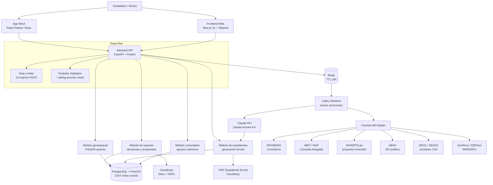
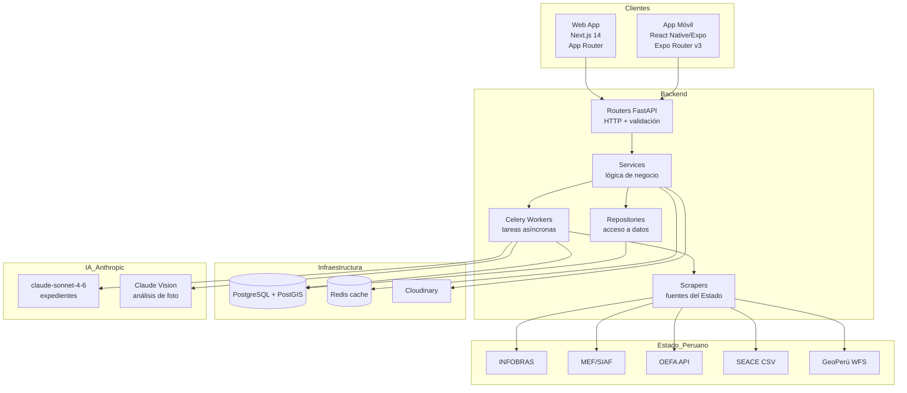
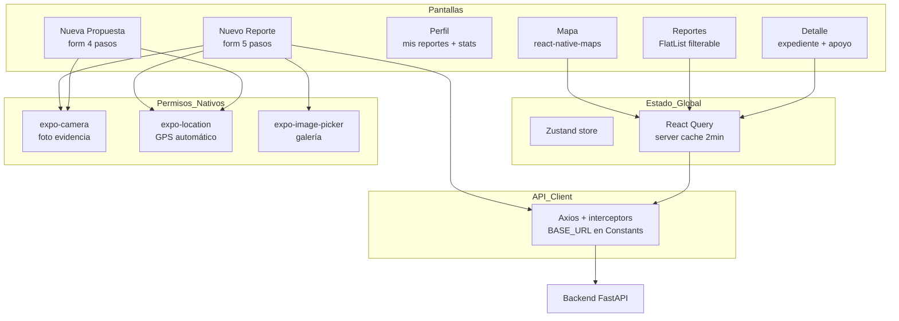
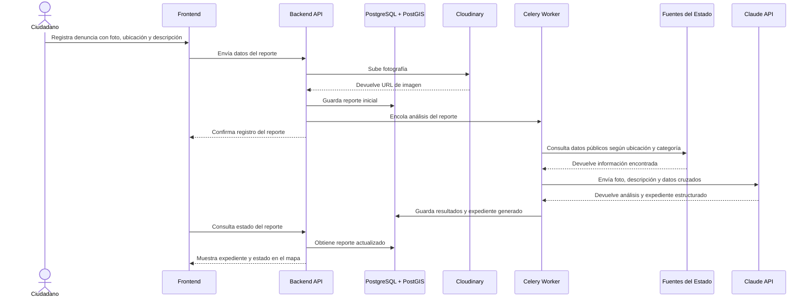
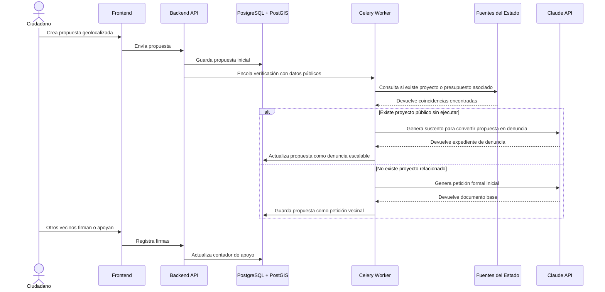
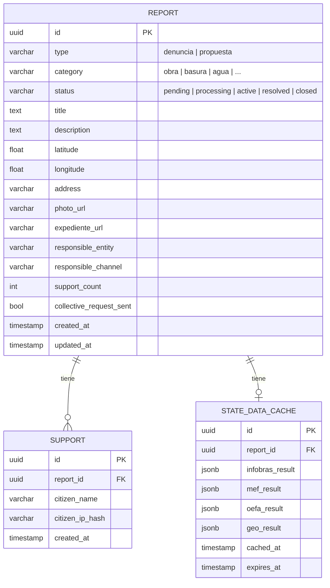
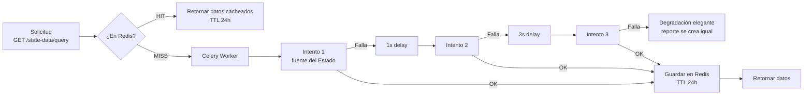
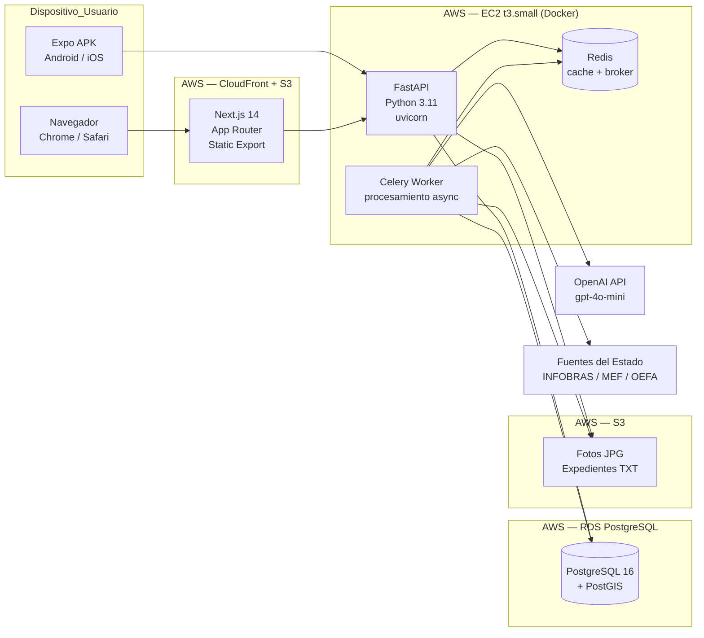

# Arquitectura del sistema - ReportaPe

## Descripción general

ReportaPe es una plataforma cívica móvil y web que permite a ciudadanos peruanos registrar denuncias o propuestas geolocalizadas, adjuntar evidencia fotográfica y convertirlas en expedientes formales mediante el cruce de datos públicos del Estado peruano y generación asistida por IA.

El sistema se organiza en módulos separados: **app móvil** (React Native/Expo), **frontend web** (Next.js), **backend/API** (FastAPI), **base de datos geoespacial** (PostgreSQL + PostGIS), **servicios de IA** (Claude API), **almacenamiento** (Cloudinary), **procesamiento asíncrono** (Celery + Redis) y **fuentes externas del Estado peruano**.

## Diagrama general de arquitectura

## Arquitectura por capas

## Arquitectura móvil (React Native / Expo)

## Comunicación entre módulos

| Módulo | Responsabilidad | Se comunica con |
|---|---|---|
| Frontend | Permite registrar reportes, propuestas, fotos, ubicación y visualizar el mapa público | Backend API |
| Backend API | Expone endpoints, valida datos y coordina la lógica principal del sistema | Frontend, Base de datos, Redis, Cloudinary |
| Módulo de reportes | Gestiona denuncias y propuestas ciudadanas | Base de datos, Cloudinary, Módulo geoespacial |
| Módulo geoespacial | Procesa coordenadas y determina ubicación territorial | PostGIS, GeoPerú / IDEPerú |
| Módulo de datos del Estado | Consulta fuentes públicas según categoría y ubicación | INFOBRAS, MEF, OEFA, SEACE, GeoPerú |
| Módulo de IA | Analiza fotos, clasifica problemas y genera expedientes formales | Claude API, Claude Vision |
| Módulo comunitario | Gestiona apoyos, firmas y escalamiento colectivo | Base de datos |
| Módulo de expedientes | Genera documentos formales listos para presentar | IA, datos del Estado, PDF |
| Workers asíncronos | Ejecutan tareas pesadas sin bloquear la API | Redis, fuentes externas, IA |
| Base de datos | Persiste usuarios, reportes, propuestas, firmas, evidencias y expedientes | Backend, Workers |

## Flujo principal - Modo denuncia

## Flujo principal - Modo propuesta

## Modelo de datos (ER simplificado)

## Capa de caché y resiliencia

## Diagrama de despliegue

> **Nota de despliegue:** Se usa AWS por créditos de equipo disponibles. El backend corre en un EC2 con `docker-compose` (FastAPI + Celery + Redis en contenedores). La BD corre en RDS para durabilidad. Las fotos y expedientes se guardan en S3. El frontend se exporta como sitio estático a S3 y se sirve via CloudFront.

## Decisiones de arquitectura

| Decisión | Opción elegida | Alternativa descartada | Razón |
|----------|---------------|----------------------|-------|
| App móvil | React Native / Expo | Flutter | Reutiliza conocimiento JS del equipo, Expo simplifica permisos y builds |
| Frontend web | Next.js 14 App Router | Vite + React SPA | SSR para SEO; export estático compatible con S3 + CloudFront (AWS) |
| Backend | FastAPI (Python) | Node.js Express | Mejor ecosistema para scraping y data science; documentación automática |
| Base de datos | PostgreSQL + PostGIS | MongoDB | Consultas geoespaciales nativas (ST_DWithin); ACID para datos cívicos |
| Cache + broker | Redis | RabbitMQ + Memcached | Un solo servicio para caché Y broker de Celery |
| Workers | Celery | FastAPI Background Tasks | Reintentos, monitoreo y escalado independiente del API |
| IA | OpenAI gpt-4o-mini | Claude Sonnet | Créditos disponibles del equipo; costo ~$0.001/expediente |
| Storage | AWS S3 | Cloudinary | Integrado con el resto de infra AWS; créditos disponibles |
| Routing móvil | Expo Router v3 | React Navigation | File-based routing = más claro para el equipo; tipado automático |
