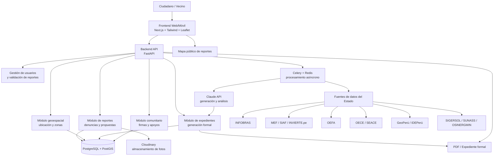
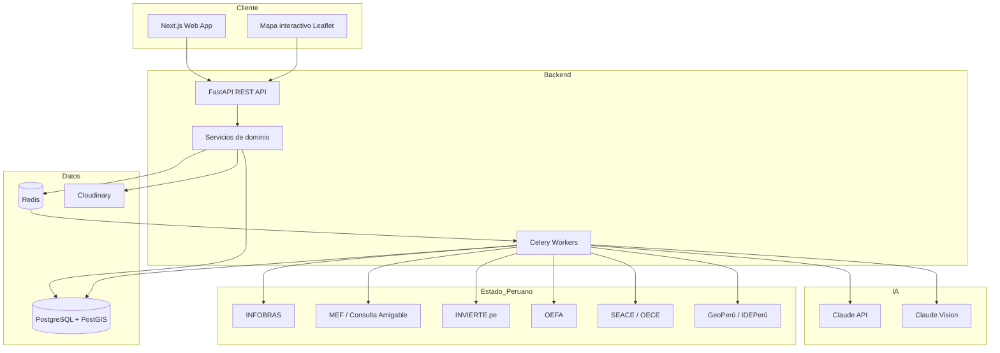
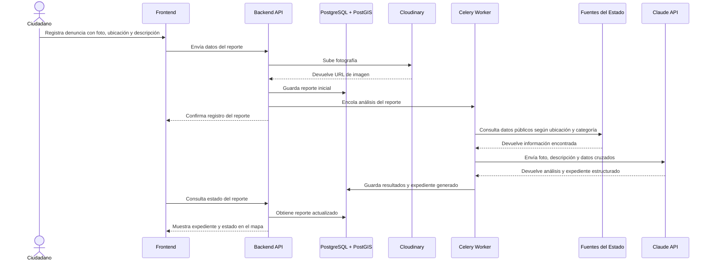
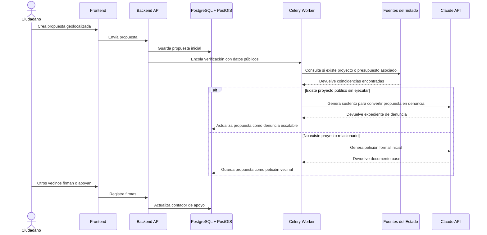

# Arquitectura del sistema - ReportaP'

## Descripción general

ReportaP' es una plataforma cívica que permite a ciudadanos registrar denuncias o propuestas geolocalizadas, adjuntar evidencia fotográfica y convertirlas en expedientes formales mediante el cruce de datos públicos del Estado peruano y generación asistida por IA.

El sistema se organiza en módulos separados: frontend, backend/API, base de datos geoespacial, servicios de IA, almacenamiento de imágenes, procesamiento asíncrono y fuentes externas del Estado.

## Diagrama general de arquitectura

## Arquitectura por capas

## Comunicación entre módulos

| Módulo | Responsabilidad | Se comunica con |
|---|---|---|
| Frontend | Permite registrar reportes, propuestas, fotos, ubicación y visualizar el mapa público | Backend API |
| Backend API | Expone endpoints, valida datos y coordina la lógica principal del sistema | Frontend, Base de datos, Redis, Cloudinary |
| Módulo de reportes | Gestiona denuncias y propuestas ciudadanas | Base de datos, Cloudinary, Módulo geoespacial |
| Módulo geoespacial | Procesa coordenadas y determina ubicación territorial | PostGIS, GeoPerú / IDEPerú |
| Módulo de datos del Estado | Consulta fuentes públicas según categoría y ubicación | INFOBRAS, MEF, OEFA, SEACE, GeoPerú |
| Módulo de IA | Analiza fotos, clasifica problemas y genera expedientes formales | Claude API, Claude Vision |
| Módulo comunitario | Gestiona apoyos, firmas y escalamiento colectivo | Base de datos |
| Módulo de expedientes | Genera documentos formales listos para presentar | IA, datos del Estado, PDF |
| Workers asíncronos | Ejecutan tareas pesadas sin bloquear la API | Redis, fuentes externas, IA |
| Base de datos | Persiste usuarios, reportes, propuestas, firmas, evidencias y expedientes | Backend, Workers |

## Flujo principal - Modo denuncia

## Flujo principal - Modo propuesta

## Decisiones iniciales de arquitectura

- Se usa **Next.js** para construir una interfaz rápida, compatible con despliegue en Vercel y adecuada para mapas interactivos.
- Se usa **FastAPI** como backend por su velocidad de desarrollo, documentación automática y buen soporte para servicios REST.
- Se usa **PostgreSQL + PostGIS** porque el sistema depende de coordenadas, búsquedas geográficas y relación entre reportes y zonas.
- Se usa **Celery + Redis** para ejecutar consultas externas y procesamiento con IA sin bloquear la experiencia del usuario.
- Se usa **Claude API** para generar expedientes formales y analizar la evidencia enviada por el ciudadano.
- Se usa **Cloudinary** para almacenar imágenes ciudadanas sin sobrecargar el backend.
- La arquitectura separa reportes, propuestas, expedientes, comunidad y datos externos para facilitar la evolución del sistema hacia la entrega final.
