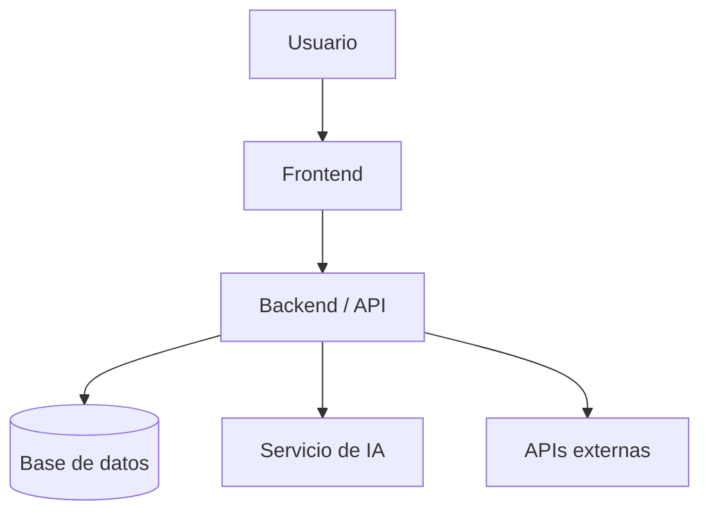

# Arquitectura del sistema

## Descripción general

TODO: Explicar brevemente la arquitectura propuesta para el proyecto.

## Diagrama de arquitectura

## Componentes principales

| Componente | Descripción |
|---|---|
| Frontend | TODO |
| Backend / API | TODO |
| Base de datos | TODO |
| Servicio de IA | TODO |
| APIs externas | TODO |

## Comunicación entre componentes

TODO: Explicar cómo se comunican los módulos principales del sistema.