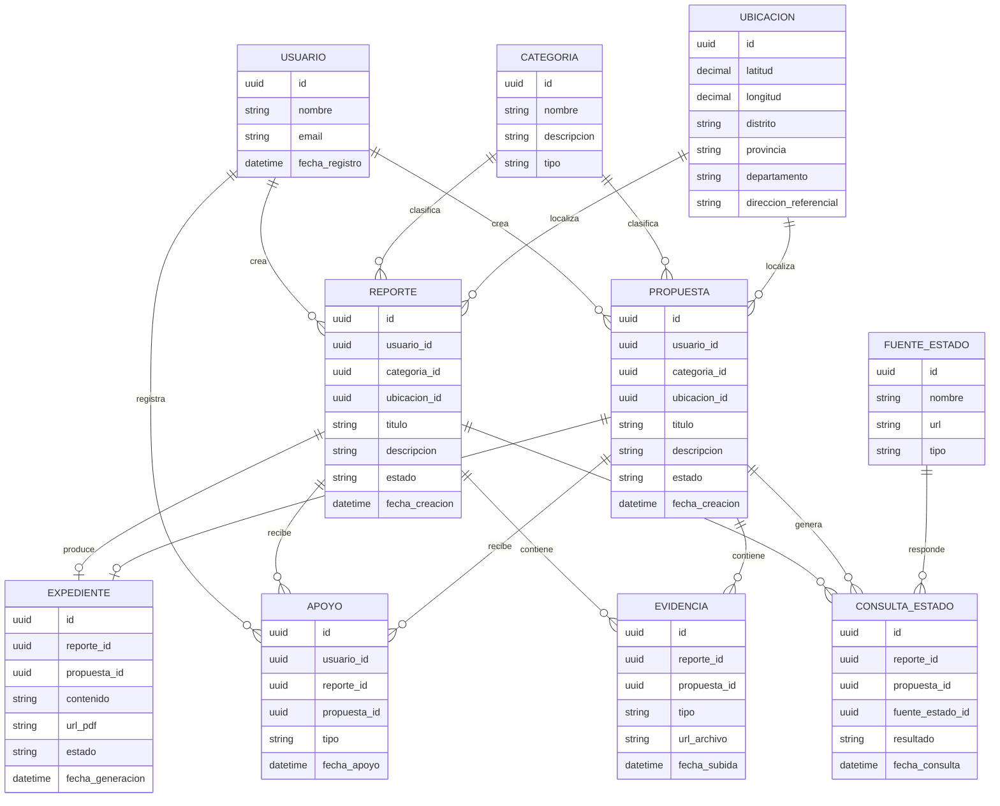

# Modelo de datos - ReportaP'

## Descripción general

El modelo de datos de ReportaP' permite registrar ciudadanos, denuncias, propuestas, evidencias, apoyos comunitarios, fuentes públicas consultadas y expedientes generados con IA.

## Entidades principales

| Entidad | Descripción |
|---|---|
| Usuario | Representa al ciudadano que registra reportes, propuestas o apoyos |
| Reporte | Denuncia ciudadana geolocalizada |
| Propuesta | Iniciativa vecinal geolocalizada |
| Evidencia | Imagen o archivo asociado a un reporte o propuesta |
| Expediente | Documento formal generado con IA |
| Apoyo | Firma o respaldo ciudadano a un reporte/propuesta |
| FuenteEstado | Fuente pública consultada para sustentar el caso |
| ConsultaEstado | Resultado de consultar datos públicos del Estado |
| Categoria | Tipo de problema o propuesta registrada |
| Ubicacion | Información geoespacial del caso |

## Diagrama entidad-relación

## Descripción de entidades

### Usuario

Representa al ciudadano que usa la plataforma.

Campos principales:

- `id`
- `nombre`
- `email`
- `fecha_registro`

### Reporte

Representa una denuncia ciudadana sobre un problema público.

Campos principales:

- `id`
- `usuario_id`
- `categoria_id`
- `ubicacion_id`
- `titulo`
- `descripcion`
- `estado`
- `fecha_creacion`

### Propuesta

Representa una iniciativa vecinal que puede convertirse en petición formal o denuncia.

Campos principales:

- `id`
- `usuario_id`
- `categoria_id`
- `ubicacion_id`
- `titulo`
- `descripcion`
- `estado`
- `fecha_creacion`

### Evidencia

Representa imágenes o archivos asociados a reportes o propuestas.

Campos principales:

- `id`
- `reporte_id`
- `propuesta_id`
- `tipo`
- `url_archivo`
- `fecha_subida`

### Expediente

Representa el documento formal generado con apoyo de IA.

Campos principales:

- `id`
- `reporte_id`
- `propuesta_id`
- `contenido`
- `url_pdf`
- `estado`
- `fecha_generacion`

### Apoyo

Representa una firma, respaldo o participación ciudadana.

Campos principales:

- `id`
- `usuario_id`
- `reporte_id`
- `propuesta_id`
- `tipo`
- `fecha_apoyo`

### FuenteEstado

Representa una fuente pública del Estado peruano.

Campos principales:

- `id`
- `nombre`
- `url`
- `tipo`

### ConsultaEstado

Representa el resultado de cruzar un reporte o propuesta con datos públicos.

Campos principales:

- `id`
- `reporte_id`
- `propuesta_id`
- `fuente_estado_id`
- `resultado`
- `fecha_consulta`

## Consideraciones iniciales

- Se usará PostgreSQL como base de datos principal.
- Se usará PostGIS para almacenar y consultar coordenadas geográficas.
- Las imágenes no se almacenan directamente en la base de datos; se guardan en Cloudinary y se referencia su URL.
- Un reporte o propuesta puede tener múltiples evidencias.
- Un reporte o propuesta puede recibir múltiples apoyos ciudadanos.
- Un expediente puede generarse desde una denuncia o desde una propuesta.
- Las consultas a fuentes del Estado quedan registradas para trazabilidad.
