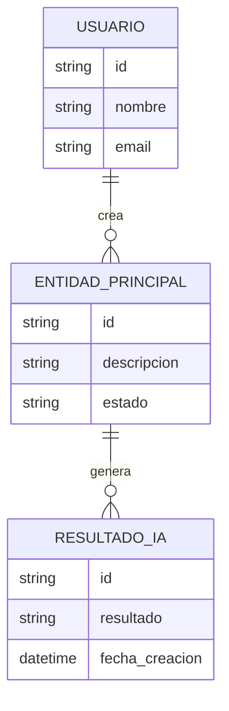

# Modelo de datos

## Entidades principales

| Entidad | Descripción | Campos principales |
|---|---|---|
| Usuario | TODO | id, nombre, email |
| EntidadPrincipal | TODO | id, descripcion, estado |
| ResultadoIA | TODO | id, resultado, fecha_creacion |

## Diagrama entidad-relación inicial

## Notas del modelo

TODO: Explicar decisiones iniciales del modelo de datos.