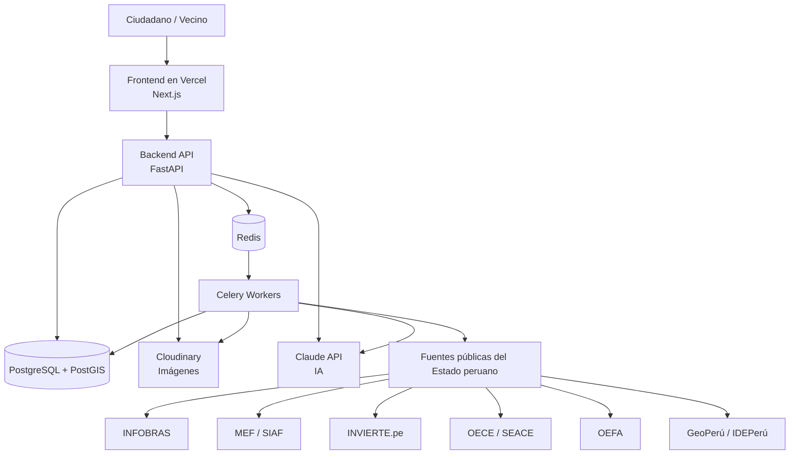
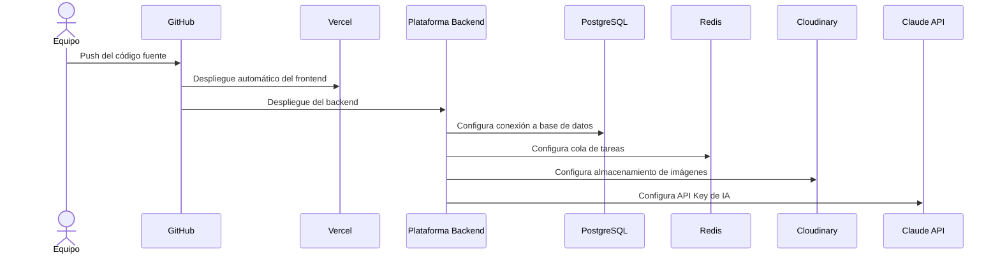

# Despliegue - ReportaP'

## Descripción general

ReportaP' se desplegará como una aplicación web compuesta por frontend, backend, base de datos, almacenamiento de imágenes, cola de procesamiento y servicios externos de IA.

## Diagrama de despliegue



## Servicios propuestos

| Componente | Plataforma propuesta | Motivo |
|---|---|---|
| Frontend | Vercel | Despliegue rápido para aplicaciones Next.js |
| Backend API | Render / Railway / Fly.io | Soporte para servicios FastAPI |
| Base de datos | Supabase / Neon / Railway PostgreSQL | PostgreSQL administrado con posibilidad de PostGIS |
| Redis | Upstash / Railway Redis | Cola para tareas asíncronas |
| Imágenes | Cloudinary | Almacenamiento de evidencia fotográfica |
| IA | Claude API | Análisis y generación de expedientes |
| Repositorio | GitHub | Control de versiones y releases |

## Flujo de despliegue



## Variables de entorno esperadas

```env
DATABASE_URL=TODO
REDIS_URL=TODO
CLOUDINARY_CLOUD_NAME=TODO
CLOUDINARY_API_KEY=TODO
CLOUDINARY_API_SECRET=TODO
ANTHROPIC_API_KEY=TODO
NEXT_PUBLIC_API_URL=TODO
```

## Consideraciones de despliegue

- El frontend debe quedar accesible mediante una URL pública.
- El backend debe exponer endpoints consumibles por el frontend.
- Las claves privadas no deben subirse al repositorio.
- Las variables sensibles deben configurarse en la plataforma de despliegue.
- El almacenamiento de imágenes debe quedar separado de la base de datos.
- Las tareas pesadas se ejecutarán mediante workers asíncronos.
- La base de datos debe soportar coordenadas geográficas mediante PostGIS.
- La URL final de producción deberá agregarse al `README.md` para el Hito 2.
