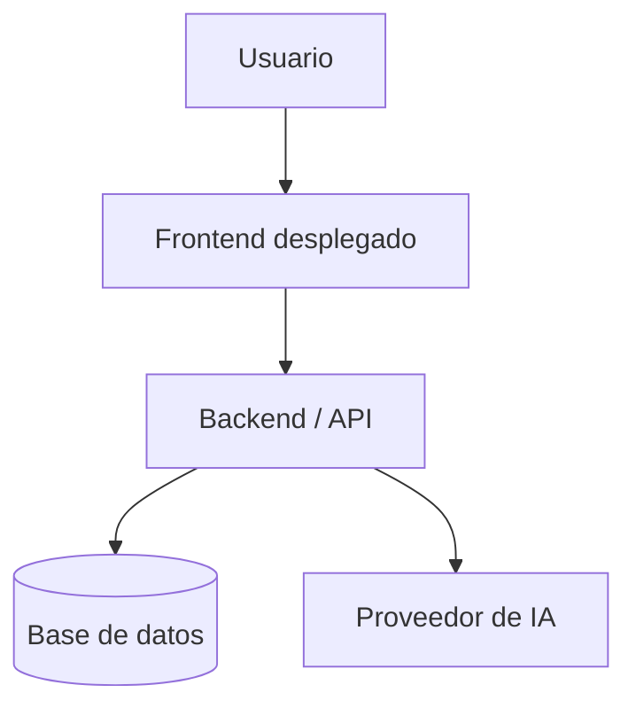

# Diagrama de despliegue

## Entorno propuesto

TODO: Explicar dónde se desplegaría el frontend, backend, base de datos y servicios de IA.

## Diagrama de despliegue

## Servicios considerados

| Servicio | Plataforma propuesta |
|---|---|
| Frontend | TODO |
| Backend / API | TODO |
| Base de datos | TODO |
| Servicio de IA | TODO |
| Repositorio | GitHub |