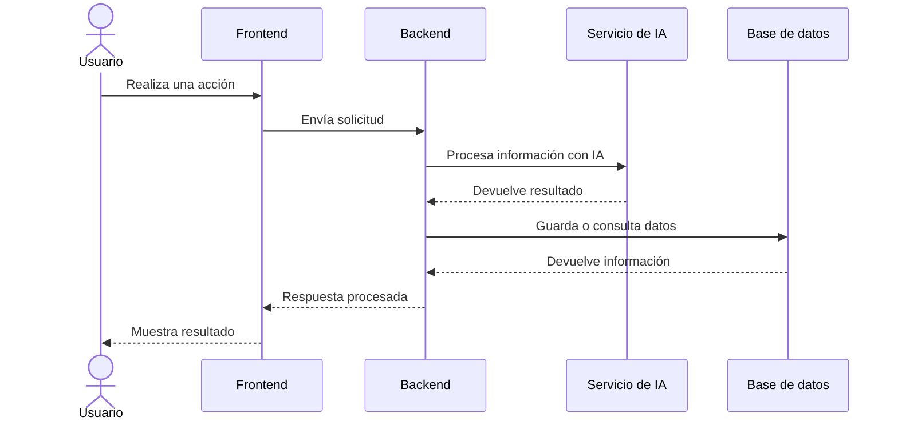

# Módulos principales del sistema

## Lista de módulos

| Módulo | Responsabilidad | Se comunica con |
|---|---|---|
| Frontend | TODO | TODO |
| Backend / API | TODO | TODO |
| Base de datos | TODO | TODO |
| Servicio de IA | TODO | TODO |
| APIs externas | TODO | TODO |

## Flujo principal del sistema

## Descripción del flujo

TODO: Describir el flujo principal del usuario dentro del sistema.